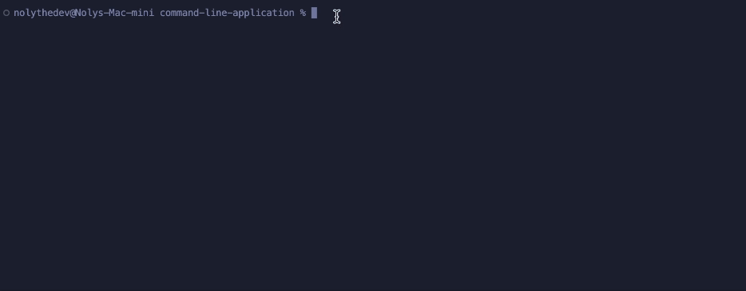

# Node.js Command Line App

## Description 

A command line app that generates a professional README.md based on user input using the Inquirer and Ora packages from npm.

The link to the video walkthrough can be found [here](https://app.screencastify.com/v3/watch/jqJ3Nu9zFKo9WL31PBpN).

## Table of Contents (Optional)

* [Installation](#installation)
* [Usage](#usage)
* [Credits](#credits)
* [License](#license)

## Installation

* Clone the repository: git clone https://github.com/nolythedev/command-line-application.git
* Navigate to the project directory: cd command-line-application.
* Open the codebase in your preferred code editor.

## Usage 

N/A

## Credits

Thank you to the edX and npm.

## License

MIT License. 

---

© 2023 edX Boot Camps LLC. Confidential and Proprietary. All Rights Reserved.
